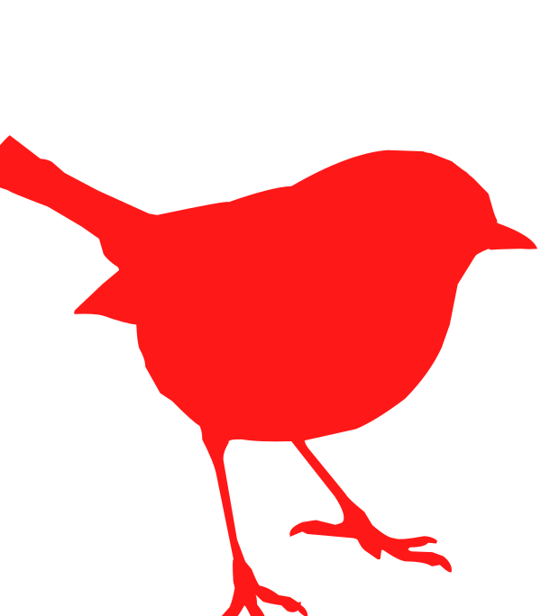
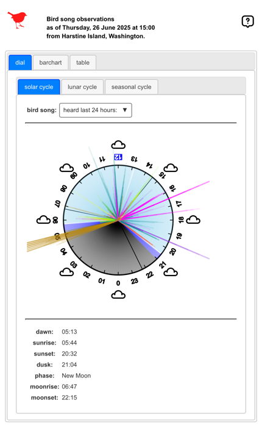
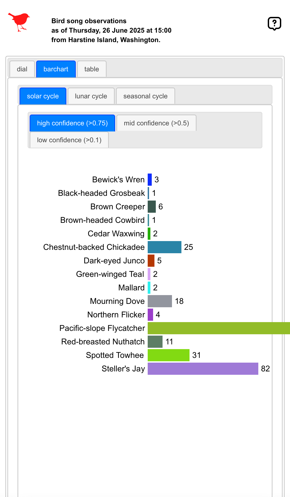
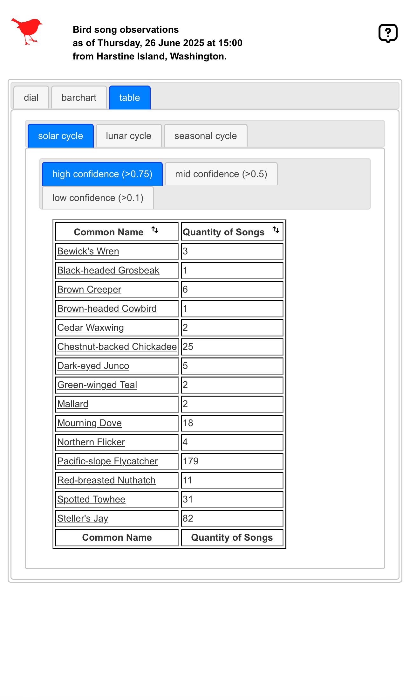

# BirdNET-BarChart

Display BirdNET-Analyzer[^1] data as a dial, bar chart, and table in a browser updating hourly with up to date data.

---

---

### Components:

* Using primarily bash, SQL, and XSLT to drive the hourly processing.
	* Run the sound recorder to capture bird song.
	* Run the analysis to identify the bird song.
	* Run queries to get celestial data.
	* Load the database with the observed species and celestial data.
	* Extract the database data to XML.
	* Transform XML using XSLT to produce charts and tables.

### User Interface:

* dial
	* 
* bar chart
	* 
* table
	* 

### Dependencies:

* [Apache](https://projects.apache.org/project.html?httpd-http_server)[optional]
* [Bash](https://linuxconfig.org/bash-scripting-tutorial-for-beginners)
* [BirdNET-Analyzer](https://github.com/kahst/BirdNET-Analyzer)[^1]
* [Java](https://www.java.com/)
* [jq](https://jqlang.org)
* [jQueryUI](https://jqueryui.com)
* [SQLite](https://sqlite.org/)
* [sshpass](https://stackoverflow.com/questions/12202587/automatically-enter-ssh-password-with-script)
* [sSMTP](https://packages.debian.org/source/unstable/ssmtp)
* [Saxon](https://www.saxonica.com/welcome/welcome.xml)
* [SVG](https://www.w3schools.com/graphics/svg_intro.asp)
* [XSLT](https://www.w3schools.com/xml/xsl_intro.asp)

[^1]:Kahl, S., Wood, C., Eibl, M., & Klinck, H. (2021). BirdNET: A deep learning solution for avian diversity monitoring. Ecological Informatics, 61, 101236.