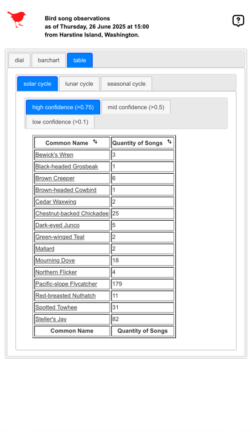

# BirdNET-BarChart

Display BirdNET-Analyzer[^1] data as a dial, bar chart, and table in a browser updating hourly with up to date data.

---

---

### Components:

#### This project transforms audio recordings to web displayable graphics of heard bird species.

* Using primarily bash, SQL, and XSLT to drive the hourly processing.
	* Run the sound recorder to capture bird song.
	* Run the analysis to identify the bird song.
	* Run queries to get celestial data.
	* Load the database with the observed species and celestial data.
	* Extract the database data to XML.
	* Transform XML using XSLT to produce charts and tables.

### User Interface:

* dial
	* 
* bar chart
	* 
* table
	* 

### Dependencies:

##### Software and what breaks if you skip it...
* [Apache](https://projects.apache.org/project.html?httpd-http_server)[optional]
	* Without a HTTP server, you will have no way to view the generated HTML from this headless configuration.
	* You may optionally choose to use any HTTP server.  My favorite is Apache.
* [Bash](https://linuxconfig.org/bash-scripting-tutorial-for-beginners)
	* Assuming you are on linux.  MacOS will likely work, but I've done no testing.
* [bc](https://www.man7.org/linux/man-pages/man1/bc.1p.html)
	* The daily calculations for moon phase will fail without bc, likely affecting the dial display of the moon.
* [BirdNET-Analyzer](https://github.com/kahst/BirdNET-Analyzer)[^1]
	* This is the engine that recognizes bird sound and assigns species.  The project is pointless without it.
* [git](https://git-scm.com)
	* This is necessary if want automatic updating.  The release is controlled using the main branch.  Without it, you would remain on a snapshot version until you changed it.
* [Java](https://www.java.com/)
	* The JRE is used execute the Saxon target referenced below.
* [jq](https://jqlang.org)
	* This is used to transform JSON to XML.  Without it, most of the external integrations will fail and cascade into the display.
* [jQueryUI](https://jqueryui.com)
	* The web user interface utilizes some tools, particularly tabs, from the jQuery UI libraries.  Without it, the user interface will render very poorly.
* [SQLite](https://sqlite.org/)
	* The primary data store, without which nothing will work.
* [sshpass](https://stackoverflow.com/questions/12202587/automatically-enter-ssh-password-with-script)
	* The backup mechanism uses this to do a remote log in, but leaving the configuration blank cause this process to do nothing.
* [sSMTP](https://packages.debian.org/source/unstable/ssmtp)
	* Sends mail to an external address using encryption protocol. Any error will be in the logs, but sometimes notification is better.
* [Saxon](https://www.saxonica.com/welcome/welcome.xml)
	* The XSLT is driven by the Saxon implementation.  Most of the XML processing including processing the latest UI components uses XSLT.
* [SVG](https://www.w3schools.com/graphics/svg_intro.asp)
	* Not exactly an dependency other that you browser needs to understand SVG. Few do not.
* [XSLT](https://www.w3schools.com/xml/xsl_intro.asp)
	* Same as above, this is a language used a lot for aspects of this projects transformation of data from audio recordings to web displayable graphics.
##### Websites
* [Astronomical Applications Department of the U.S. Naval Observatory](https://aa.usno.navy.mil)
	* Certain celestial data will be lost, affecting the user interface.
* [OpenStreetMap](https://openstreetmap.org/)
	* Locale labeling display will be lost, affecting the user interface.
* [OpenWeatherMap](https://openweathermap.org/)
	* Certain weather data will be lost, affecting the user interface.

[^1]:Kahl, S., Wood, C., Eibl, M., & Klinck, H. (2021). BirdNET: A deep learning solution for avian diversity monitoring. Ecological Informatics, 61, 101236.