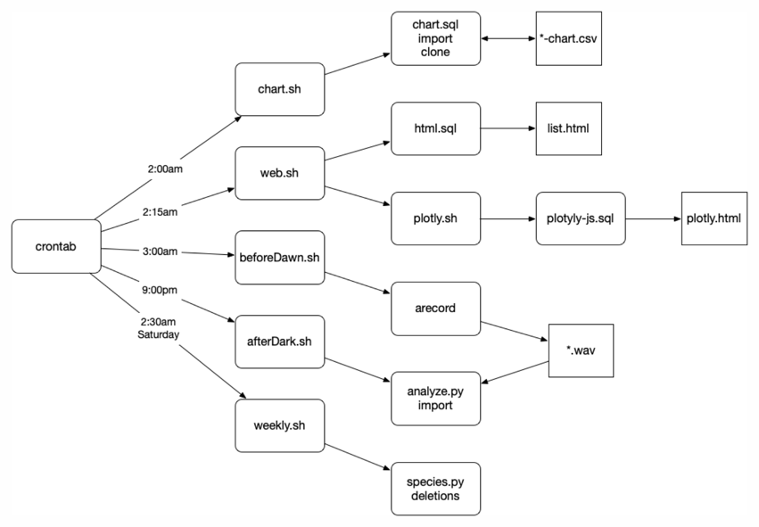

# Code

This is what is actually implemented so far.

---

### Components:

* chart.sh
  * chart.sql
  * import curated data to database
  * clone database
* web.sh
  * html.sql > list.html
  * plotly.sh
    * plotly-js.sql > plotly.html
* beforeDawn.sh
  * arecord to WAV files
* afterDark.sh
  * analyze.py (from BirdNET-Analyzer)
  * import raw data to database
* weekly.sh
  * species.py (from BirdNET-Analyzer) for updates
  * delete old files

### Dependencies:

* Bash
* SQLite